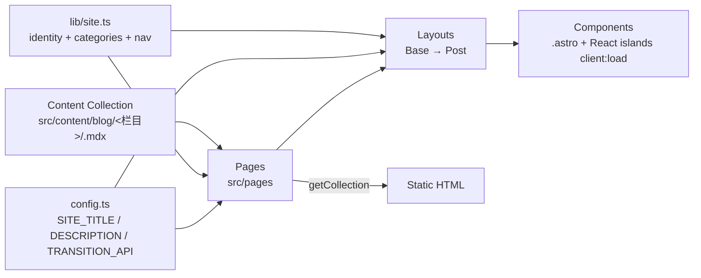

# Repository Guidelines

## Project Overview

**astro-duohuo / 多火知识库** is the NUIST DH (南信大 DH) internet-tech club's knowledge base. It started as a fork of the **Astrofy** template but has been substanially refactored into a category-driven (栏目式) knowledge base. All pages are statically generated; there is no SSR/runtime server.

The content is Markdown/MDX organized under nine top-level categories — `agent`, `rag`, `infra`, `algorithm`, `train`, `rl`, `networking`, `development`, `system` — and the site renders category indexes, post details, an all-posts page, and an RSS feed.

## Tech Stack

- **Astro 7** (`astro@^7`) with integrations `@astrojs/mdx`, `@astrojs/sitemap`, `@astrojs/react`.
- **Tailwind CSS 4** via the `@tailwindcss/vite` plugin. Config is **CSS-first**: there is **no `tailwind.config.cjs`** — theming lives in `src/styles/global.css` using `@import "tailwindcss"`, `@theme inline { … }`, and `@plugin "@tailwindcss/typography"`. shadcn/ui design tokens (`--background`, `--foreground`, `--radius`, …) drive all colors.
- **React 19 + shadcn/ui (new-york)** on top of `radix-ui` and `lucide-react`/`lucide-react` icons. shadcn primitives live in `src/components/ui/` and are added via `components.json` (`@/components/ui` alias).
- **Self-hosted Geist + Geist Mono** woff2 fonts served from `/public/fonts/` and declared as `@font-face` at the top of `global.css`.
- **daisyUI is fully removed.** Do not reintroduce `data-theme="lofi"` or daisyUI classes — styling is shadcn/Tailwind-utility only.

## Architecture & Data Flow



- **Static output** — `astro.config.mjs` has no `output` key; default static build to `dist/`.
- **One content collection** — `blog`, defined in `src/content.config.ts` using the `glob({ pattern: '**/*.{md,mdx}', base: './src/content/blog' })` loader. The Zod schema is the authoritative frontmatter contract. Bodies render via `render(post)` → `<Content />` (Astro 7 content-layer API; `entry.render()` is no longer used).
- **栏目 (category) source of truth** — `src/lib/site.ts` exports `categories: Category[]` (slug / label / description). The category of a post is the **first path segment of its `id`** (e.g. `"agent/context-engineering-strategies"` → `"agent"`). Helpers: `getCategory(slug)`, `categoryOf(id)`, `slugOf(id)`.
- **Layout chain** — `BaseLayout.astro` (HTML shell: `<BaseHead/>`, sticky header with `<MobileNav/>`, `<SiteSidebar/>` on desktop, `<Footer/>`, and `<ClientRouter/>` when `TRANSITION_API` is on) wraps `PostLayout.astro`, which slots the rendered Markdown and renders the category badge, date, author, tags, and optional hero image.
- **Interactivity** — unlike the old template, this site **does hydrate React islands**: `<SiteSidebar client:load>` and `<MobileNav client:load>` in `BaseLayout.astro`. Astro `<ClientRouter />` (View Transitions) is enabled by default via `TRANSITION_API = true` in `config.ts`. There is no global state; nav active-state is passed as an `activeItem` prop.
- **Routing** is file-based under `src/pages/`. Category listing and post detail use nested dynamic params `[category]/index.astro` and `[category]/[slug].astro`.

## Key Directories

|Path|Purpose|
|---|---|
|`src/config.ts`|Minimal global constants: `SITE_TITLE`, `SITE_DESCRIPTION`, `TRANSITION_API`. Imported by `BaseLayout.astro` and `rss.xml.js`.|
|`src/lib/site.ts`|Site identity (`siteConfig`), top nav (`navItems`), the nine **栏目** (`categories`), social links, and category helpers. Edit categories/labels/nav here.|
|`src/lib/utils.ts`|`cn()` classname merge helper for shadcn components.|
|`src/content.config.ts`|Zod schema + `glob` loader for the `blog` collection (the frontmatter contract).|
|`src/content/blog/<栏目>/`|MDX/MD posts, nested one level per category.|
|`src/pages/`|File-based routes (see Route map).|
|`src/layouts/`|`BaseLayout`, `PostLayout`. No `StoreItemLayout`.|
|`src/components/`|Mixed: `.astro` (`BaseHead`, `Footer`, `HorizontalCard`) and `.tsx` islands (`site-sidebar`, `mobile-nav`, `site-nav`, `social-icons`).|
|`src/components/ui/`|shadcn/ui primitives (`button`, `card`, `sidebar`, `sheet`, `input`, `badge`, `tooltip`, `separator`, `skeleton`) — managed via `components.json`.|
|`src/hooks/use-mobile.ts`|React hook used by the shadcn sidebar/sheet.|
|`src/styles/global.css`|Tailwind 4 entrypoint: `@font-face` for Geist, `@import "tailwindcss"`, `@theme inline` tokens, `@plugin "@tailwindcss/typography"`. Also imported once by `BaseHead.astro`.|
|`public/duohuo/`|Brand assets: `logo-girl-450.webp`, `logo-girl-800.webp`, `icon.svg`. Default OG image is `/duohuo/logo-girl-800.webp`.|
|`public/fonts/`|Self-hosted `Geist-Variable.woff2`, `Geist-Italic.woff2`, `GeistMono-Variable.woff2`.|
|`public/robots.txt`|Static.|
|`components.json`|shadcn/ui config (style `new-york`, css `src/styles/global.css`, aliases under `@/*`).|

### Route map

|Route|File|Notes|
|---|---|---|
|`/`|`index.astro`|栏目 cards (with per-category post counts) + 4 most recent posts.|
|`/404`|`404.astro`||
|`/blog`|`blog/index.astro`|All posts, `pubDate` desc.|
|`/blog/<category>`|`blog/[category]/index.astro`|One page per entry in `categories`; filters posts by `id.startsWith(category + "/")`.|
|`/blog/<category>/<slug>`|`blog/[category]/[slug].astro`|`getStaticPaths` splits `post.id` into `category` + `slug`. Renders through `PostLayout`.|
|`/rss.xml`|`rss.xml.js`|`@astrojs/rss` over the `blog` collection; links are `/blog/${post.id}/`.|

There are **no** `/cv`, `/projects`, `/services`, or `/store` routes — those were removed during the refactor.

## Development Commands

Package manager is **pnpm** (`.npmrc` sets `shamefully-hoist=true`; `pnpm-workspace.yaml` allows builds for `esbuild` and `sharp`). No test/lint/format scripts are defined.

```bash
pnpm install      # install deps
pnpm run dev      # start dev server (alias: pnpm start)
pnpm run build    # static build → dist/
pnpm run preview  # preview the built site
```

Runtime: **Node ≥ 22, pnpm 11** (enforced in `.github/workflows/deploy.yml`).

**Before deploying, update the stale identity strings** still pointing at the template:
- `astro.config.mjs` → `site = 'https://astrofy-template.netlify.app'` should be the real domain (e.g. `https://docs.duohuo.org.cn`).
- `public/robots.txt` → `Sitemap:` URL still references `astrofy-template.netlify.app`.
- `src/components/Footer.astro` → still credits "Manuel Ernesto" / "Astrofy".
- `package.json` → `name: "astrofy"` and the Astrofy `description` are stale.

Deploy target is **Cloudflare Pages** project `duohuo-docs` → [docs.duohuo.org.cn](https://docs.duohuo.org.cn), driven by `.github/workflows/deploy.yml` on push to `main`.

## Code Conventions & Common Patterns

- **Language**: TypeScript in `.astro` frontmatter, `.ts` modules, and `.tsx` islands. `tsconfig.json` extends `astro/tsconfigs/base` with `strictNullChecks: true`.
- **Path aliases** (`tsconfig.json`):
  - `@/*` → `src/*` (preferred for new code; used by `[category]` routes and `*.tsx` islands)
  - `@components/*` → `src/components/*`
  - `@layouts/*` → `src/layouts/*`
  - Legacy relative imports still appear in older files (`index.astro`, `blog/index.astro`, `BaseLayout`). Match the surrounding file when editing.
- **Content collection** (canonical data pattern):
  ```ts
  const posts = (await getCollection('blog'))
    .sort((a, b) => b.data.pubDate.valueOf() - a.data.pubDate.valueOf());
  const cat = post.id.split('/')[0];              // category slug
  const { Content } = await render(post);         // Astro 7 content layer
  ```
  Dates use `z.coerce.date()`, so frontmatter like `pubDate: 2026-06-24` works.
- **Frontmatter contract** (`src/content.config.ts`): `title`, `description`, `pubDate`, `author` (default `"DH 社员"`), optional `updatedDate`, `heroImage`, `badge`, `tags` (default `[]`).
- **URLs derive from the filesystem `id`, not from the title.** There is **no `createSlug`** anymore and **no `GENERATE_SLUG_FROM_TITLE` flag**. A post at `src/content/blog/networking/openwrt-campus-multilink.mdx` is served at `/blog/networking/openwrt-campus-multilink/` and appears in RSS at the same path — they stay in sync by construction. Renaming/moving a file changes its URL everywhere.
- **Images**: `astro:assets` `<Image>` for optimized webp (hero images render at 750×422). Brand/default assets live in `public/duohuo/` and `/public/fonts/`, referenced by absolute path.
- **Styling**: Tailwind 4 utilities + shadcn semantic tokens inline (`bg-background`, `text-foreground`, `text-muted-foreground`, `border-input`, …). `@tailwindcss/typography` provides the `.prose` wrapper used in `PostLayout`. Dark mode is wired via `@custom-variant dark (&:is(.dark *))` but no theme toggle ships currently.
- **Components**: `.astro` components declare props with inline `interface Props { … }`. `.tsx` islands are default-exported React function components hydrated with `client:load`. shadcn primitives follow the standard `cn()` + `class-variance-authority` pattern.
- **Dates in UI**: `dayjs` + `dayjs/plugin/localizedFormat`, formatted with `'ll'`.
- **`HorizontalCard`** is the post-list item; it takes `title`, `desc`, `url`, `pubDate`, `author`, `category`, `categoryLabel`, and `tags`. It does **not** derive `tag_url` by stripping URL segments anymore.

## Important Files

- **`src/lib/site.ts`** — edit site identity, the 栏目 list (slug/label/description/order), top nav, and social links here. This is the primary config surface.
- **`src/config.ts`** — secondary: `SITE_TITLE`, `SITE_DESCRIPTION`, `TRANSITION_API` (View Transitions toggle). Kept because `BaseLayout` and `rss.xml.js` import it.
- **`src/content.config.ts`** — Zod schema + loader for the `blog` collection.
- **`astro.config.mjs`** — integrations `mdx()`, `sitemap()`, `react()`; Tailwind wired through `vite.plugins`. `@astrojs/rss` is a dependency used as a manual endpoint (`src/pages/rss.xml.js`), **not** registered as an integration.
- **`src/layouts/BaseLayout.astro`** — HTML shell; composes sidebar + mobile nav + footer, gates `<ClientRouter/>` on `TRANSITION_API`.
- **`src/styles/global.css`** — Tailwind 4 entrypoint and the single source of design tokens.
- **`components.json`** — shadcn/ui config; use `pnpm dlx shadcn@latest add <component>` to add primitives into `src/components/ui/`.

## Runtime / Tooling Preferences

- **Runtime**: Node ≥ 22. No `.nvmrc` / `.node-version` — version is pinned only in the deploy workflow.
- **Package manager**: **pnpm 11** (required — `shamefully-hoist=true` is needed for Astro under pnpm). Do not introduce `package-lock.json` or `yarn.lock`.
- **Build**: Astro static build. No PostCSS config (Tailwind runs via `@tailwindcss/vite`).
- **No formatter/linter**: no Prettier/ESLint config — follow existing style in-file.
- **No env files committed** (`.env`, `.env.production` are gitignored; none present).

## Testing & QA

**None configured.** There is no test framework (no vitest/jest/playwright), no test scripts in `package.json`, and no coverage tooling. `src/env.d.ts` only references Astro's own types.

When verifying changes, rely on:
- `pnpm run build` — a clean build catches type/content-collection errors.
- `pnpm run dev` + manual navigation of the affected route (especially `/blog/<category>` and `/blog/<category>/<slug>`).
- For content-collection changes, confirm `getCollection()` still sorts/renders and that links stay consistent across `blog/[category]/[slug].astro`, `blog/index.astro`, `index.astro`, and `rss.xml.js` — all of them build URLs from `post.id` directly, so they move together.

License: **MIT** (holder: Manuel Ernesto Garcia, 2022) — inherited from Astrofy.
